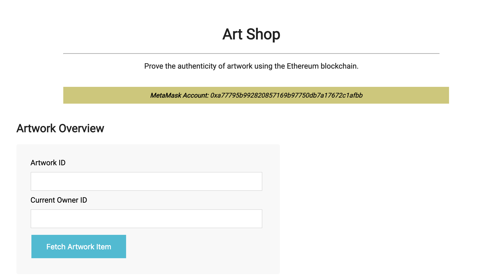

# Art Shop - Udacity Project
*a decentralized app that lets artists sell their work on the blockchain*

## Art Supply chain & data auditing

This repository containts an Ethereum DApp that demonstrates an Artwork Supply Chain flow between an Artist and Art Adopter. The user story is similar to any commonly used supply chain process. An artist can add artworks to the inventory of adoptable art stored in the blockchain. An Art Adopter can adopt the artwork, for a fee, from the inventory system. Additionally an Artist can mark an artwork as Framed and ready for pick-up. The Shipper thens ships and marks the artwork as Delivered to the Art Adopter.


## Getting Started

These instructions will thee project up and running in your local development environment.

### Prerequisites

Install Truffle and Ganache (or optionally ganache-cli). Enable the MetaMask extension in your browser. See info below for the versions used by this project.

### Installing

Clone this repository:

```
git clone https://github.com/lauraweindorf/art-shop
```

Change directory to the ```art-shop/dapp``` folder and install all requisite npm packages (as listed in ```package.json```):

```
cd art-shop/dapp
npm install
```

Launch Ganache:


Or you can use `ganache-cli`, but you'll need to modify the port setting in `truffle.js` to 8545:

```
ganache-cli -m "apart ice rhythm antenna regular tattoo hint outer mushroom invite sail huge"
```

In a separate terminal window, Compile smart contracts:

```
truffle compile
```

This will create the smart contract artifacts in the ```dapp/build/contracts``` folder.

Migrate smart contracts to the locally running blockchain (Ganache):

```
truffle migrate
```

Test smart contracts:

```
truffle test
```

All tests should pass.


## Interacting with the Art Supply Chain contract

Run the local development server to start the Art Shop dapp, which will launch the UI in your browser.

```
npm run dev
```




### Going through the stages of the Art Supply Chain

Initially the blockchain will not have any artworks or transaction history. Some artwork fields are filled in for you to make Creating the Artwork easier, but you can modify the Artist and Artwork details as desired.

NOTE: Clicking in an address field will automatically populate it with the current MetaMask account. You can go through the different stages Truffle Ganache account that was used to deploy the contracts, or you can setup MetaMask with a separate Ganache account for each of the roles: Artist, Art Adopter, Shipper.

(The states are displayed at the top of the UI as you go through the supply chain process. Notice that the current artwork owner ID changes as you progress through the supply chain stages.)

1. Fill in the artist and artwork details and click `Create`

2. Move the artwork to the next stage by clicking `Frame`

3. Enter an artwork price in Ether and clickj `Put Up For Adoption`

4. Click into the Art Adopter ID field to fill in the address and click `Adopt`

5. Prepare the artwork for pick-up by the Shipper by clicking `Pack`

6. Click into the Shipper ID field to fill in the address and click `Pick Up`

7. Mark the artwork as shipped by clicking on `Ship`

8. Finally, to indicate the artwork was delivered the Shipper clicks `Deliver`

After going through the different stages of the Artwork (Created, Framed, etc.) your transaction history should look like the list below.


## Built With

* [Ethereum](https://www.ethereum.org/) - Ethereum is a decentralized platform that runs smart contracts
* [IPFS](https://ipfs.io/) - IPFS is the Distributed Web | A peer-to-peer hypermedia protocol
to make the web faster, safer, and more open.
* [Truffle Framework](http://truffleframework.com/) - Truffle is the most popular development framework for Ethereum with a mission to make your life a whole lot easier.


## Authors

Adapted from the [Udacity Supply chain & data auditing](https://github.com/udacity/nd1309-Project-6b-Example-Template) project.
Adapted from the [Truffle Framework's Pet Shop Tutorial](https://truffleframework.com/tutorials/pet-shop) by Josh Quintal.

See also the list of [contributors](https://github.com/lauraweindorf/art-shop/contributors.md) who participated in this project.

## Acknowledgments

* Solidity v0.5.4
* Ganache v1.3.1
* Truffle v5.0.5
* IPFS